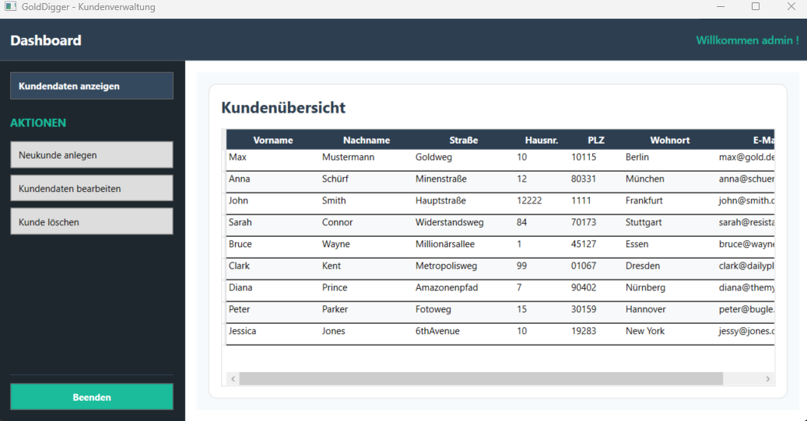

# Customer Management WPF

A C# WPF desktop application for managing customer data, built with MVVM, Entity Framework Core and SQLite.

## Features

* User authentication
* Create, view, edit and delete customer records
* Input validation for customer data
* Persistent data storage with SQLite
* Database access using Entity Framework Core
* MVVM-based application structure
* WPF desktop interface

## Tech Stack

* C# / .NET
* WPF
* MVVM
* Entity Framework Core
* SQLite
* LINQ

## Application Structure

The application follows the **Model-View-ViewModel (MVVM)** pattern to separate the user interface from application and data logic.

Entity Framework Core is used for communication between the application and the SQLite database, allowing customer records to be stored and managed persistently.

## CRUD Operations

The application implements the fundamental CRUD operations for customer management:

* **Create** – add new customer records
* **Read** – display stored customer data
* **Update** – edit existing customer information
* **Delete** – remove customer records

User input is validated before changes are stored in the database.

## Project Background

This application was created as an educational C# project to practice desktop application development with WPF and the MVVM pattern, as well as database integration using Entity Framework Core and SQLite.
